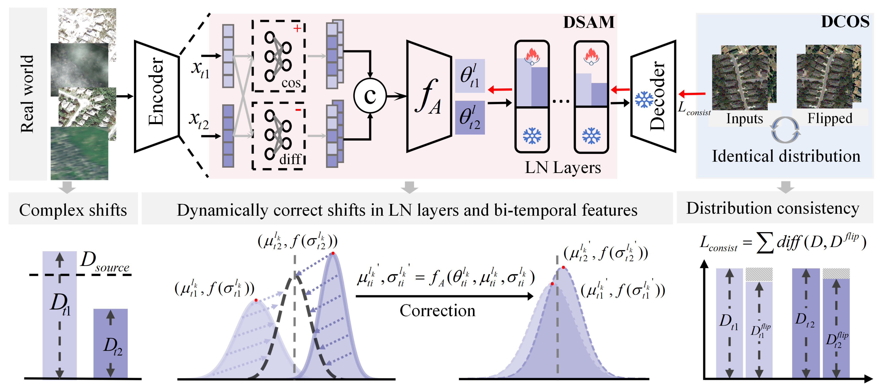

# Real-CD: Change Detection Under Real-World Complex Interference via Dynamic Distribution Correction
Leyuan Fang, Senior Member, IEEE, Yi Fang, Pedram Ghamisi, Senior Member, IEEE, and Qiang Liu. Accepted by IEEE TIP 2026
<div align="center">
    
</div>


# Getting Started

## step1: Environment Setup:

We recommend using a conda environment with Python 3.8 and installing dependencies via `pip`.
```bash
conda create -n realcd python==3.10
conda activate realcd
pip install -r requirements.txt
```
## step2: Our Change Detection Benchmark :

Our simulated benchmark based on DSIFN, SYSU, and CLCD is available at:
👉 [Benchmark Dataset Link](https://pan.baidu.com/s/1vaRLaHhK-NcDmb0zJOEzTw?pwd=91nq)

## step3: Model Training:

To train ChangeFormer on the datasets, run the corresponding shell script and modify the data path and parameters inside.


```commandline
bash scripts/run_train_ChangeFormer_xxx.sh
```

We provide pretrained checkpoints for quick reproduction:
👉 [Pretrained Checkpoints](https://pan.baidu.com/s/1vaRLaHhK-NcDmb0zJOEzTw?pwd=91nq 提取码: 91nq)

## step4: Model Test Time Adaptation
Our work is evaluated on our change detection datasets: DSIFN‑C, SYSU‑C, CLCD‑C.
The core implementation is located in ```tta_methods/Ours```.

Run the evaluation script (modify data paths and parameters as needed):
```bash
bash scripts/eval_ChangeFormer_xxx_all.sh
```
Metric results are saved in the ```ckpt/log_test.txt``` folder.

Final prediction visualizations are saved in the ```visualization/``` folder.


## Citation


## Acknowledgment

This code is mainly built upon [ChangeFormer](https://github.com/wgcban/ChangeFormer) and [Online Test Time adaptation](https://github.com/mariodoebler/test-time-adaptation) repositories. We thank the authors for their great work.

